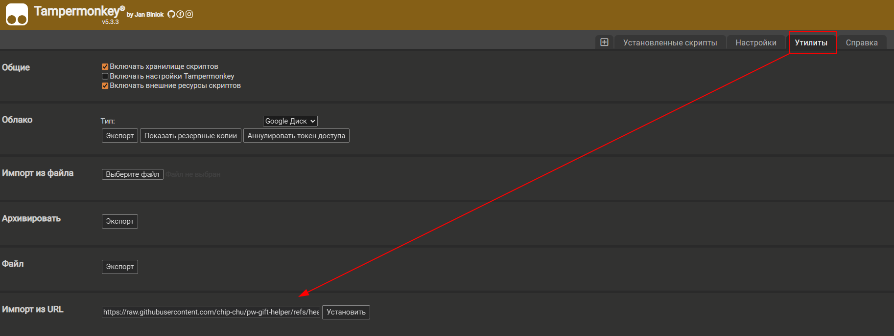
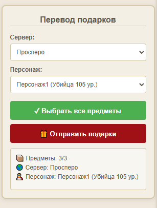
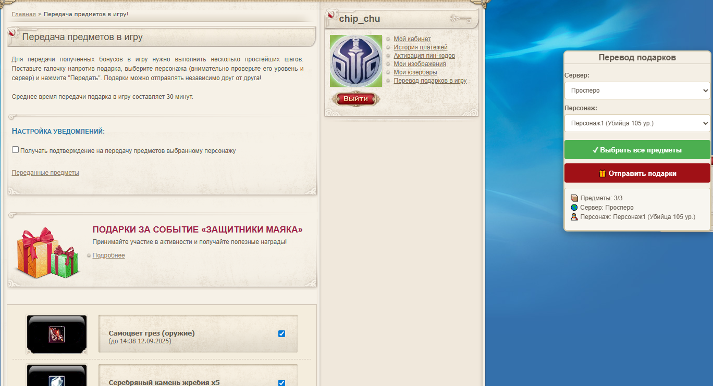
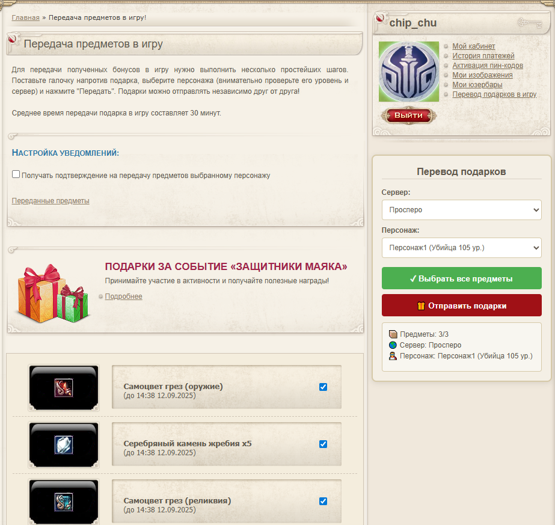
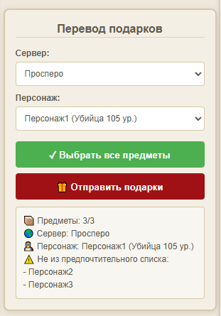

# Скрипт для автоматизации отправки подарков для pwonline.ru


## Шаги установки:
1. Установите расширение [Tampermonkey](https://www.tampermonkey.net/)
2. Установите скрипт
   - Скопируйте [ссылку на скрипт](https://raw.githubusercontent.com/chip-chu/pw-gift-helper/refs/heads/main/send_gifts.js)
   - Импортируйте в расширении  
     
3. Перейдите на страницу [перевода подарков](https://pwonline.ru/promo_items.php)
   - Скрипт автоматически активируется и выберет все подарки и первый сервер с персонажем


## Интерфейс:
Панель управления интегрирована в правую колонку сайта и содержит:
 - Выбор сервера
 - Выбор персонажа
 - Информационная панель, показывает текущий статус выбора



## Настройки конфигурации скрипта:
1. Управление автоматическим выбором всех подарков при загрузке страницы
   - Для управления этим поведением измените значение `CONFIG.autoSelectItems`
     ```js
     autoSelectItems: false // Установите значение false для отмены автоматического выбора
     autoSelectItems: true // Установите значение true для включения автоматического выбора
     ```
2. Управление интеграцией панели в страницу после блока авторизации
   - Для управления этим поведением измените значение `CONFIG.integrateIntoPage`
     ```js
     integrateIntoPage: false // Установите значение false для отмены интеграции
     integrateIntoPage: true // Установите значение true для включения интеграции
     ```
   - Примеры:
      - При `integrateIntoPage: false`  
        
      - При `integrateIntoPage: true`  
        
3. Управление выборами сервера и персонажами для их автоматического выбора
   - Для управления поведением автоматического выбора сервера измените значение `CONFIG.preferredServerName`
      ```js
     preferredServerName: '' // Установите пустое значение для отмены выбора сервера
     preferredServerName: 'Просперо' // Установите значение имени сервера для его автоматического выбора
     ```
   - Для управления поведением автоматического выбора персонажа измените значение `CONFIG.preferredCharacterNames`
      ```js
     preferredCharacterNames: [] // Установите пустое значение для отмены выбора персонажа
     preferredCharacterNames: ['Персонаж1', 'Персонаж2',] // Установите значение имен ваших персонажей для их автоматического выбора
     ```
     При включении этой опции добавляется дополнительная информация в панель, если вручную был выбран персонаж не из списка.  
     